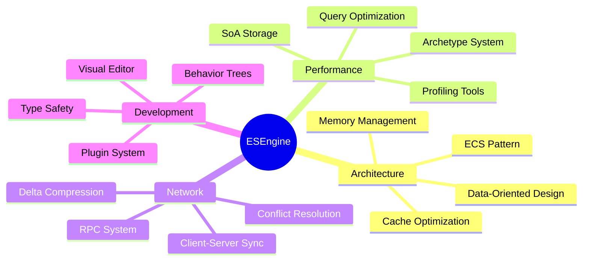

<div align="center">

```
███████╗███████╗███████╗███╗   ██╗ ██████╗ ██╗███╗   ██╗███████╗
██╔════╝██╔════╝██╔════╝████╗  ██║██╔════╝ ██║████╗  ██║██╔════╝
█████╗  ███████╗█████╗  ██╔██╗ ██║██║  ███╗██║██╔██╗ ██║█████╗
██╔══╝  ╚════██║██╔══╝  ██║╚██╗██║██║   ██║██║██║╚██╗██║██╔══╝
███████╗███████║███████╗██║ ╚████║╚██████╔╝██║██║ ╚████║███████╗
╚══════╝╚══════╝╚══════╝╚═╝  ╚═══╝ ╚═════╝ ╚═╝╚═╝  ╚═══╝╚══════╝
```

[](https://git.io/typing-svg)


</div>

```bash
$ system.boot --mode=production
> Initializing ESEngine Framework...
> Loading core modules... [OK]
> Mounting distributed systems... [OK]
> System ready. Welcome, Developer.
```

---

## 🔧 SYSTEM OVERVIEW

<div align="center">

```typescript
interface DeveloperProfile {
  role: "Game Engine Architect";
  specialization: ["ECS Architecture", "Real-time Systems", "Network Synchronization"];
  currentProject: "High-Performance Entity-Component-System Framework";
  techStack: {
    primary: ["TypeScript", "JavaScript", "Node.js"];
    architecture: ["ECS", "Behavior Trees", "Client-Server Model"];
    tools: ["Tauri", "React", "WebSocket", "Monorepo"];
  };
  performance: {
    cacheOptimization: "SoA (Structure of Arrays)";
    memoryLayout: "Archetype System";
    querySystem: "Reactive with O(1) lookups";
  };
}
```

</div>

---

## 📊 REAL-TIME METRICS

<div align="center">

### 🎯 Performance Dashboard

<table>
<tr>
<td width="50%">

#### Repository Statistics


</td>
<td width="50%">

#### Code Distribution


</td>
</tr>
</table>

### ⚡ Activity Metrics


### 📈 Contribution Graph


</div>

---

## 🏗️ CORE PROJECT: ECS FRAMEWORK

<div align="center">

[](https://github.com/esengine/ecs-framework)

</div>

```diff
+ High-Performance Entity-Component-System Framework
+ Type-Safe | Real-time | Distributed Architecture
```

### ⚙️ Technical Specifications

<table>
<tr>
<td width="33%" align="center">

**🎯 Core Engine**
```
• Archetype-based ECS
• SoA Memory Layout
• Reactive Query System
• O(1) Component Access
```

</td>
<td width="33%" align="center">

**🌐 Network Layer**
```
• Client-Server Sync
• Delta Compression
• Conflict Resolution
• WebSocket Transport
```

</td>
<td width="33%" align="center">

**🔧 Development Tools**
```
• Visual Editor (Tauri)
• Behavior Tree Editor
• Performance Profiler
• Debug Inspector
```

</td>
</tr>
</table>

### 🎮 Architecture Highlights

```
┌─────────────────────────────────────────────────────────────┐
│                    ECS FRAMEWORK STACK                       │
├─────────────────────────────────────────────────────────────┤
│  Editor Layer        │  Tauri + React Visual Editor          │
│  Behavior Tree       │  Visual Node Editor + Runtime         │
│  Network Layer       │  Client/Server Sync + RPC             │
│  ECS Core           │  Archetype + SoA + Reactive Queries   │
│  Serialization      │  Scene + Component + Incremental      │
│  Platform           │  Node.js + Browser + Cross-platform   │
└─────────────────────────────────────────────────────────────┘
```

---

## 💻 TECHNOLOGY STACK

<div align="center">

### Core Technologies


### Frameworks & Libraries


### Architecture & Patterns


</div>

---

## 🎯 CORE COMPETENCIES

<div align="center">



</div>

---

## 🔥 RECENT ACTIVITY

<!--START_SECTION:activity-->
<!--END_SECTION:activity-->

---

## 📡 SYSTEM METRICS

<div align="center">


<table>
<tr>
<td>


</td>
<td>


</td>
</tr>
<tr>
<td>


</td>
<td>


</td>
</tr>
</table>

</div>

---

## 🏆 ACHIEVEMENTS

<div align="center">

[](https://github.com/ryo-ma/github-profile-trophy)

</div>

---

## 📮 CONNECT

<div align="center">

```bash
$ connect --protocol=github --target=esengine
> Establishing secure connection...
> Connection established.
```

[](https://github.com/esengine)
[](https://github.com/esengine/ecs-framework)

</div>

---

<div align="center">

```
╔══════════════════════════════════════════════════════════════╗
║  "Building elegant architectures through performance and     ║
║   maintainability engineering"                               ║
╚══════════════════════════════════════════════════════════════╝
```

**⚡ Powered by Open Source | Optimized for Performance | Built for Scale ⚡**


</div>
